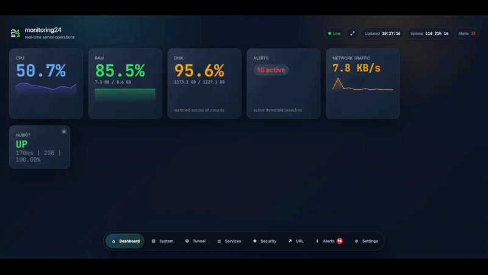

> **Real-time server monitoring dashboard — single binary, zero config, instant insights.**

A lightweight, production-ready monitoring web application built in Go. Drop it on any Linux server and get an instant real-time dashboard with system health, Cloudflare Tunnel status, security events, service monitoring, and user-defined URL health checks.

---

## ✨ Features

| Category | What You Get |
|---|---|
| **System Health** | CPU (per-core + averaged), RAM, Swap, Disk per mount, Disk I/O, Network I/O, Load averages, Uptime |
| **Real-time Updates** | Server-Sent Events push data every 2 seconds — no polling, no full reloads |
| **Cloudflare Tunnel** | Detect `cloudflared` process, tunnel name, uptime, connection/disconnection events |
| **Security** | SSH login events from `/var/log/auth.log`, top attacker IPs, pending system/security updates |
| **Services** | systemd service status, sub-state, restart count, active since timestamp |
| **URL Monitors** | Add/edit/delete URLs from the UI — per-URL status, latency, 24h uptime%, history |
| **Alert Engine** | Threshold-based alerts (CPU, RAM, disk, swap, URL down) stored in SQLite, auto-resolve |
| **Dark Mode** | System-default theme with toggle, persisted to `localStorage` |
| **Single Binary** | All assets embedded via `go:embed` — just copy one file and run |

---

## 🚀 Quick Start

```bash
# Clone and build
git clone https://github.com/masoudx/monitoring24
cd monitoring24
go build -o monitoring24 ./cmd/server

# Run (default port: 47291)
./monitoring24

# Open in browser
open http://localhost:47291
```

That's it. The database (`./data/monitor.db`) is created automatically on first run.

---

## 📋 Requirements

- **Go 1.25+** (for building)
- **Linux/Ubuntu** (optimised target — also runs on macOS and Windows with graceful degradation)
- No root required, no config files, no environment variables

---

## ⚙️ CLI Flags

| Flag | Default | Description |
|---|---|---|
| `--port` | `47291` | HTTP listen port |
| `--host` | `0.0.0.0` | Bind address (`127.0.0.1` recommended behind a tunnel) |
| `--data-dir` | `./data` | Directory for `monitor.db` |
| `--basic-auth` | *(disabled)* | HTTP basic auth: `user:password` (password is bcrypt-hashed on startup) |
| `--services` | *(built-in list)* | Comma-separated systemd service names to monitor |
| `--log-level` | `info` | Log verbosity: `debug`, `info`, `warn` |

### Examples

```bash
# Default (all interfaces, port 47291)
./monitoring24

# Bind only to localhost, behind Cloudflare Tunnel
./monitoring24 --host 127.0.0.1 --port 47291

# Enable basic auth
./monitoring24 --basic-auth admin:supersecretpassword

# Custom services + custom port
./monitoring24 --services nginx,postgresql,redis,myapp --port 9321

# Custom data directory
./monitoring24 --data-dir /var/lib/monitoring24
```

---

## 🔨 Building from Source

```bash
# Development build (current platform)
make build

# Run with auto-reload (restarts on .go/.html/.css/.js changes)
make dev

# Production build — Linux x86_64
make cross-linux

# Linux ARM64 (Raspberry Pi, ARM servers)
make cross-linux-arm64

# All targets at once
make cross-all

# Run tests
make test
```

### Cross-compilation matrix

| Target | Command | Output |
|---|---|---|
| Linux x86_64 | `make cross-linux` | `monitoring24-linux-amd64` |
| Linux ARM64 | `make cross-linux-arm64` | `monitoring24-linux-arm64` |
| Windows x86_64 | `make cross-windows` | `monitoring24-windows-amd64.exe` |
| macOS (native) | `make build` | `monitoring24` |

All builds are **CGO-free** (`CGO_ENABLED=0`) — no C compiler needed, pure Go.

---

## 🖥️ Deployment on Ubuntu

### 1. Copy the binary

```bash
scp monitoring24-linux-amd64 user@your-server:/tmp/monitoring24
ssh user@your-server
sudo mv /tmp/monitoring24 /usr/local/bin/monitoring24
sudo chmod +x /usr/local/bin/monitoring24
```

### 2. Create a dedicated user

```bash
sudo useradd --system --no-create-home --shell /sbin/nologin monitoring24
sudo usermod -aG adm monitoring24   # grants /var/log/auth.log read access
sudo mkdir -p /var/lib/monitoring24
sudo chown monitoring24:monitoring24 /var/lib/monitoring24
```

### 3. Install the systemd service

```bash
sudo cp monitoring24.service /etc/systemd/system/
sudo systemctl daemon-reload
sudo systemctl enable monitoring24
sudo systemctl start monitoring24
sudo systemctl status monitoring24
```

### 4. Check logs

```bash
sudo journalctl -u monitoring24 -f
```

---

## 🌐 Cloudflare Tunnel Integration

monitoring24 is designed to run **behind a Cloudflare Tunnel** — bind it to localhost and expose it publicly via `cloudflared`.

### 1. Bind to localhost only

```bash
./monitoring24 --host 127.0.0.1 --port 47291 --basic-auth admin:yourpassword
```

### 2. Configure your Cloudflare Tunnel

In your `~/.cloudflared/config.yml`:

```yaml
tunnel: your-tunnel-id
credentials-file: /home/user/.cloudflared/your-tunnel-id.json

ingress:
  - hostname: monitor.yourdomain.com
    service: http://localhost:47291
    originRequest:
      noTLSVerify: false
  - service: http_status:404
```

### 3. Important: SSE buffering

Add these nginx directives if you're using nginx as a reverse proxy in front of cloudflared:

```nginx
location / {
    proxy_pass http://127.0.0.1:47291;
    proxy_buffering off;
    proxy_cache off;
    proxy_set_header Connection '';
    proxy_http_version 1.1;
    chunked_transfer_encoding on;
}
```

The app sets `X-Accel-Buffering: no` automatically for the SSE endpoint.

---

## 🔐 Security Notes

- **Basic auth**: Use `--basic-auth` when exposing publicly. The plaintext password is **never stored** — it is bcrypt-hashed immediately on startup.
- **Auth log access**: The monitor process needs to be in the `adm` group on Debian/Ubuntu to read `/var/log/auth.log`. The provided systemd unit handles this.
- **Bind to localhost**: When using Cloudflare Tunnel, always use `--host 127.0.0.1`.
- **No root required**: The service runs as a dedicated `monitoring24` user.

---

## 🧩 Platform Support

| Platform | System Metrics | SSH Monitoring | Services | Tunnel Detection |
|---|---|---|---|---|
| **Ubuntu/Debian** | ✅ Full | ✅ `/var/log/auth.log` | ✅ systemctl | ✅ process scan |
| **RHEL/CentOS** | ✅ Full | ✅ `/var/log/secure` | ✅ systemctl | ✅ process scan |
| **macOS** | ✅ Partial (no load avg) | ⚠️ N/A (no auth.log) | ⚠️ N/A (no systemd) | ✅ process scan |
| **Windows** | ✅ Partial | ⚠️ N/A | ⚠️ N/A | ✅ process scan |

Unsupported metrics show "N/A" in the UI — the app never crashes on missing data.

---

## 📁 Project Structure

```
monitoring24/
├── cmd/server/main.go          Entry point, embed directive, collector loop
├── internal/
│   ├── config/config.go        CLI flag parsing
│   ├── storage/
│   │   ├── schema.go           Model structs + SQL schema
│   │   └── sqlite.go           Database wrapper
│   ├── metrics/
│   │   ├── system.go           CPU/RAM/disk/network via gopsutil
│   │   ├── app.go              Self-metrics (goroutines, heap, process)
│   │   └── network.go          Connection count snapshot
│   ├── alerts/alerts.go        Threshold evaluation engine
│   ├── urlcheck/checker.go     Per-URL goroutines + CRUD
│   ├── security/
│   │   ├── security.go         Snapshot builder + apt-get check
│   │   └── authlog.go          Incremental auth.log parser
│   ├── tunnel/tunnel.go        cloudflared process detection
│   ├── services/services.go    systemctl queries
│   ├── sse/broker.go           SSE hub (register/broadcast/heartbeat)
│   └── http/
│       ├── handlers.go         REST API handlers
│       └── routes.go           Route wiring + middleware
├── web/
│   ├── index.html              Single-page app (Tailwind CSS)
│   └── static/
│       ├── app.js              Vanilla JS: state management + SSE + rendering
│       └── style.css           Custom animations and overrides
├── Makefile
├── monitoring24.service        systemd unit file
└── README.md
```

---

## 🤝 Contributing

1. Fork the repo
2. Create a feature branch: `git checkout -b feature/my-feature`
3. Make your changes
4. Run tests: `make test && make vet`
5. Submit a pull request

---

## 📜 License

MIT — see [LICENSE](LICENSE) for details.

---

<p align="center">Built with Go · SQLite · Server-Sent Events · Tailwind CSS</p>